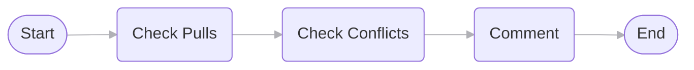
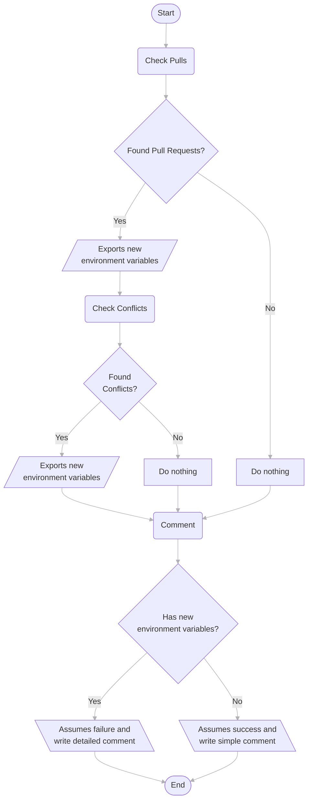

<h1 align="center">
    
    Pull Request Tracker
</h1>

A GitHub Action to track <b>similar</b> or <b>duplicated</b> Pull Requests. <i>"A maintainers must-have!"</i> - Me.

    
    
    

 

> **Warning** This project is under development.

## Getting Started

These instructions will get you a copy of the project up and running on your local machine for development and testing purposes. See deployment for notes on how to deploy the project on a live system.

### Features

- Automatically gets triggered with new Pull Requests.
- Analyzes all open Pull Requests that modify the same files.
- Checks if there are merge conflicts among the Pull Requests found.
- Creates a detailed comment on the newly created Pull Request.

### Modules

- [x] Check pulls
- [x] Check conflicts
- [ ] Check hunks (In development)

### How it works

Detailed flowchart

## License

`Pull Request Tracker` is free and open-source software licensed under the [MIT](./LICENSE.md) License. The icon used is from [Phosphor Icons](https://phosphoricons.com/) licensed under the MIT License.