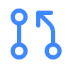
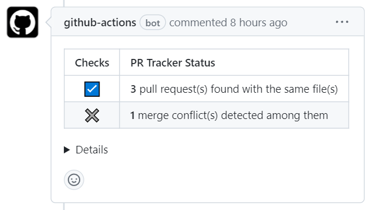
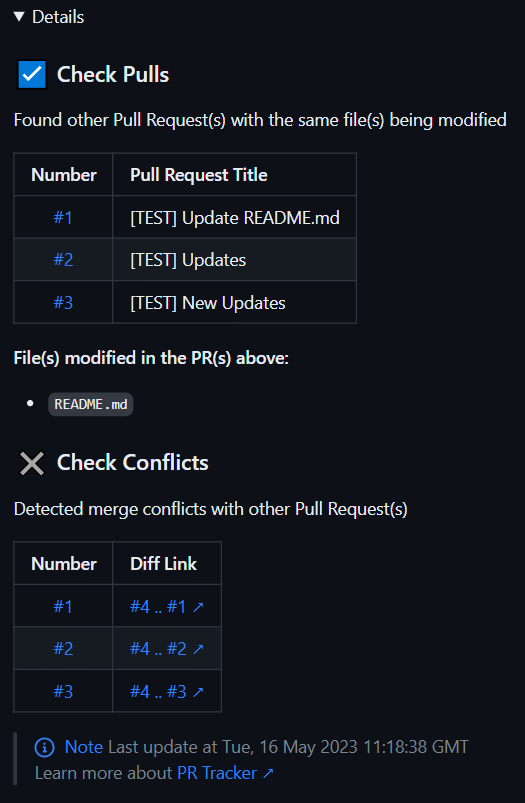

<h1 align="center">
    
    Pull Request Tracker
</h1>

<p align="center">A GitHub Action to track <b>similar</b> or <b>duplicated</b> Pull Requests.

<div align="center">
</div>

<div align="center">
    <a href="https://www.gnu.org/software/bash/">
        
    </a>
    <a href="https://github.com/features/actions">
        
    </a>
    <a href="https://github.com/sponsors/mateusabelli">
        
    </a>
</div>

<br>

> **Warning** This project is under development.

## Getting Started

Use this Action on your repository to easily track similar or duplicated Pull Requests. It runs automatically whenever someone opens a new PR and scans all open PRs for different patterns listed on the Features section. The output is a detailed comment with useful information including diff links in case of detected conflicts.

<div>
<picture >
	<source
		srcset=".github/demo-dark-1.png"
		media="(prefers-color-scheme: dark)"
	/>
	<source
		srcset=".github/demo-light-1.png"
		media="(prefers-color-scheme: light), (prefers-color-scheme: no-preference)"
	/>
	
</picture>

<h2>Features</h2>

<ul>
	<li> Automatically gets triggered with new Pull Requests.</li>
	<li>Analyzes all open Pull Requests that modify the same files.</li>
	<li>Checks if there are merge conflicts among the Pull Requests found.</li>
	<li>Creates a detailed comment on the newly created Pull Request.</li>
</ul>
</div>

## Usage

```yaml
# .github/workflows/pr-tracker.yml
name: "PR Tracker"
on:
  pull_request:
    types: [opened]

jobs:
  pr-track:
    runs-on: ubuntu-latest
    steps:
      - uses: mateusabelli/pr-tracker@v0.0.1-alpha
```

### Requirements & Limitations

For this action to work, you must grant write permissions to the default token that GitHub provides. This is going to allow the internal usage of `gh` on the scripts.

The settings are located on `https://github.com/<OWNER>/<REPOSITORY>/settings/actions`.<br>Under **Workflow permissions**, select **Read and Write permission** then click Save.

> **Warning**
You must handle the comments cleanup manually, although they are posted only upon PR openings, or with other events added on the workflow action, many activations can cause multiple comments. **This will be addressed once the projects matures.**

### Optional inputs

Additional inputs are also available, for normal usage you won't need to modify these but they are available just in case.

```yaml
- uses: mateusabelli/pr-tracker@v0.0.1-alpha
  with:
	owner:
	repository:
	pr_number:
	token:
```

| Input | Description | Default |
| -- | -- | -- |
| `owner` | Name of the owner or organization | `github.repository_owner` |
| `repository` | Name of the repository | `github.event.repository.name` |
| `pr_number` | Number of the Pull Request | `github.event.number`
| `token` | Token required to use GitHub CLI in the workflow | `github.token`

## Motivation

This project was created to participate on the _"Maintainers Must-Have"_ category on the [DEV + GitHub Hackathon](https://dev.to/devteam/announcing-the-github-dev-2023-hackathon-4ocn). My initial idea was to create a tool that could identify if someone is opening a PR that makes the same or similar changes of other contributors with open PRs. To achieve this, I planned three major modules, one for checking pulls, checking conflicts and one for checking hunks.


### Modules Development

- [x] Check pulls
- [x] Check conflicts
- [ ] Check hunks (In development)

## How it works

### Flowchart

```mermaid
flowchart LR
	737386("Check Pulls") --> 885552{"Found Pull Requests?"}
	linkStyle 0 stroke:#b1b1b6
	885552 -->|"Yes"| 147358[/"Exports new \nenvironment <span>variables</span>"/]
	linkStyle 1 stroke:#b1b1b6
	885552 -->|"No"| 301196["Do nothing"]
	linkStyle 2 stroke:#b1b1b6
	147358 --> 170819("Check Conflicts")
	linkStyle 3 stroke:#b1b1b6
	170819 --> 120741{"Found \nConflicts?"}
	linkStyle 4 stroke:#b1b1b6
	120741 -->|"Yes"| 860237[/"Exports new \nenvironment variables"/]
	linkStyle 5 stroke:#b1b1b6
	120741 -->|"No"| 611854["Do nothing"]
	linkStyle 6 stroke:#b1b1b6
	860237 --> 343045("Comment")
	linkStyle 7 stroke:#b1b1b6
	349329{"Has new \nenvironment variables?"} -->|"Yes"| 299642[\"Assumes failure and\n<span>write detailed comment</span>"\]
	linkStyle 8 stroke:#b1b1b6
	349329 -->|"No"| 463077[\"Assumes success <span>and</span>\n<span>write </span><span>simple comment</span>"\]
	linkStyle 9 stroke:#b1b1b6
	299642 --> 264246(["End"])
	linkStyle 10 stroke:#b1b1b6
	463077 --> 264246
	linkStyle 11 stroke:#b1b1b6
	343045 --> 349329
	linkStyle 12 stroke:#b1b1b6
	907594(["Start"]) --> 737386
	linkStyle 13 stroke:#b1b1b6
	301196 --> 343045
	linkStyle 14 stroke:#b1b1b6
	611854 --> 343045
	linkStyle 15 stroke:#b1b1b6
```



### Composed comment

<details>
<summary>Click to expand</summary>



</details>

## Contributing

All contributions are welcome and appreciated! Please create an [Issue](https://github.com/mateusabelli/pr-tracker/issues) or [Pull Request](https://github.com/mateusabelli/pr-tracker/pulls) if you encounter any problems or have suggestions for improvement.

If you want to say **thank you** or/and support active development of `Pull Request Tracker`

-  Add a [GitHub Star](https://github.com/mateusabelli/pr-tracker) to the project.
- Tweet about the project [on your Twitter](https://twitter.com/intent/tweet?url=https%3A%2F%2Fgithub.com%2Fmateusabelli%2Fpr-tracker&text=PR%20Tracker%20is%20a%20GitHub%20Action%20to%20track%20similar%20or%20duplicated%20Pull%20Requests%20on%20GitHub.%20Check%20it%20out%21%0A%0A).
- Write interesting articles about project on [Dev.to](https://dev.to/), [Medium](https://medium.com/) or personal blog.

## Acknowledgments

- https://dev.to/devteam/announcing-the-github-dev-2023-hackathon-4ocn
- https://docs.github.com/en/actions/creating-actions
- https://stackoverflow.com/
- https://chat.openai.com/
- https://github.com/matiassingers/awesome-readme
- https://github.com/create-go-app/cli#readme
- https://www.mermaidflow.app/

> ... and many others missing on the list.

## License

`Pull Request Tracker` is free and open-source software licensed under the [MIT](./LICENSE.md) License.<br>The icon used is from [Phosphor Icons](https://phosphoricons.com/) licensed under the MIT License.